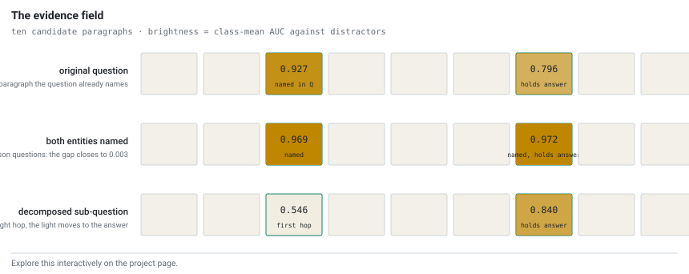
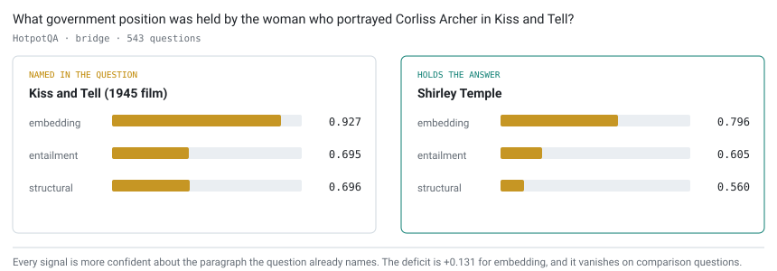
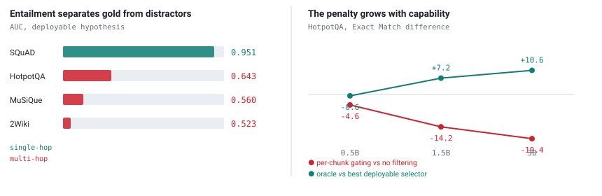
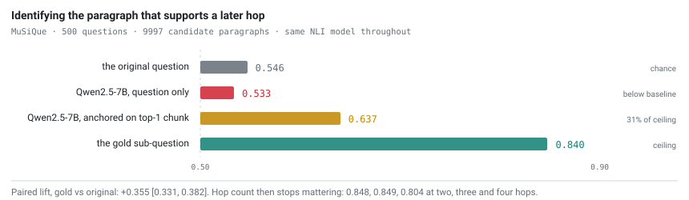
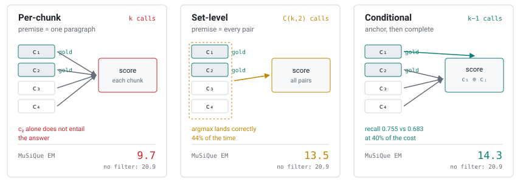

<div align="center">

# Verification Without Sufficiency

**Per-chunk filtering fails on multi-hop RAG, and decomposition repairs it**

[](paper/final_paper.pdf)
[](https://arxiv.org/abs/XXXX.XXXXX)
[](https://iamhero2709.github.io/verification-without-sufficiency/)
[](LICENSE)

**Randhir Kumar** · Independent Researcher

[](mailto:randhir2709vns@gmail.com)
[](https://www.linkedin.com/in/randhir-kumar-861573301)
[](https://x.com/randhir302)
[](https://huggingface.co/randhir302)

### [→ Explore the interactive project page](https://iamhero2709.github.io/verification-without-sufficiency/)

<a href="https://iamhero2709.github.io/verification-without-sufficiency/">
  <picture>
    <source media="(prefers-color-scheme: dark)" srcset="assets/fig5-field-dark.svg">
    
  </picture>
</a>

<sub>Ten candidate paragraphs for one question. Brightness is the class-mean AUC
against distractors. Under the original question the light lands on the paragraph
the question already names; under the decomposed sub-question it moves to the one
holding the answer. <a href="https://iamhero2709.github.io/verification-without-sufficiency/">Switch between the three conditions live.</a></sub>

</div>

---

A common way to reduce hallucination in retrieval-augmented generation is to
score each retrieved chunk and drop the ones that fail. We show this cannot work
for multi-hop questions, explain why, and measure what does work.

Per-chunk scoring assumes each chunk is a **sufficient premise** for the answer.
Multi-hop questions are built so that none is, and the paragraph carrying the
answer is the one the question does not name. A verifier conditioned on the
question is therefore strongest on the evidence already in hand and weakest on
the evidence being sought.

<picture>
  <source media="(prefers-color-scheme: dark)" srcset="assets/fig2-mechanism-dark.svg">
  
</picture>

## Results at a glance

Separating gold evidence from hard distractors, AUC:

| Signal | HotpotQA | 2Wiki | MuSiQue | SQuAD *(single-hop)* |
|:--|:--:|:--:|:--:|:--:|
| embedding cosine | 0.887 | 0.807 | 0.762 | 0.933 |
| **NLI entailment** | **0.643** | **0.523** | **0.560** | **0.951** |
| HRR structural | 0.620 | — | — | — |

Entailment works on single-hop and fails on multi-hop. Everything below explains
that one row.

<picture>
  <source media="(prefers-color-scheme: dark)" srcset="assets/fig4-cost-dark.svg">
  
</picture>

**Where the signals point.** On HotpotQA bridge questions, embedding similarity
separates the paragraph *named in the question* from distractors at 0.941, and
the paragraph *containing the answer* at 0.849. On 2Wiki compositional questions
the gap is 0.979 against 0.708. It vanishes on comparison questions, which name
both entities.

**What it costs.** End to end on three datasets, three generator sizes and two
prompts, per-chunk gating is significantly worse than not filtering at all in
every cell, and the penalty grows with generator capability.

| Qwen2.5 | 0.5B | 1.5B | 3B |
|:--|:--:|:--:|:--:|
| per-chunk gating vs no filtering, ΔEM | −4.6 | −14.2 | **−19.4** |
| oracle selector vs best deployable, ΔEM | −0.6 | +7.2 | **+10.6** |

**What repairs it.** Conditioning the hypothesis on the decomposed sub-question
instead of the original query:

<picture>
  <source media="(prefers-color-scheme: dark)" srcset="assets/fig3-repair-dark.svg">
  
</picture>

| Hypothesis built from | AUC [95% CI] | % of ceiling |
|:--|:--:|:--:|
| the original question | 0.546 [0.523, 0.569] | 0% |
| Qwen2.5-7B, question only | 0.533 [0.510, 0.557] | −6% |
| Qwen2.5-7B, anchored on top-1 chunk | 0.637 [0.611, 0.662] | **31%** |
| the gold sub-question | **0.840** [0.824, 0.856] | 100% |

Paired lift, gold vs original: **+0.355** [0.331, 0.382]. Hop count then stops
mattering: 0.848, 0.849 and 0.804 at two, three and four hops.

Iterative retrieval systems already produce these decompositions, for retrieval,
and discard them before verifying.

## Three ways to score evidence

The three schemes differ only in what counts as a premise. Per-chunk scoring
asks whether one paragraph entails the answer, which for a second hop it cannot.
Set-level scoring restores sufficiency but searches blindly. Conditional
selection anchors on the paragraph the embedding signal identifies reliably,
then asks which paragraph completes it.

<picture>
  <source media="(prefers-color-scheme: dark)" srcset="assets/fig1-schemes-dark.svg">
  
</picture>

Algorithm 1 in the paper gives the conditional selector. It costs `k-1`
cross-encoder calls against `C(k,2)` for blind pair search, and recovers 7 to 15
points of gold recall. It still does not beat leaving retrieval alone.

## Seven controls

Each rules out a competing explanation for the multi-hop failure.

| # | Control | Result |
|:--|:--|:--|
| 1 | three datasets | 0.643 / 0.523 / 0.560, all weak |
| 2 | question type | deficit vanishes when both entities are named |
| 3 | hop count | embedding falls 0.819 → 0.677 from 2 to 4 hops |
| 4 | premise length | longer premises score *lower*: 148w → 0.540, 198w → 0.025 |
| 5 | single-hop control | same pipeline reaches 0.951 on SQuAD |
| 6 | decision threshold | at the most permissive τ, 84% of gold is already rejected |
| 7 | retriever | deficit holds across bge, e5 and gte |

Plus: NLI model scale (44M / 184M / 435M), answer-matching criterion (deficit
moves by ≤ 0.007 across three definitions), and generation prompt (ordering
unchanged).

## Every experiment

Fifteen runs, $24, five hours. Two are gates: if the number came back wrong, the
expensive stages were cancelled. Each writes per-question traces to `results/`.

| | Experiment | Question it asked | Result | Cost |
|:--|:--|:--|--:|--:|
| **E1** | Signal separation | how well does each signal separate gold from distractors? | `.887 / .643 / .620` | $1.0 |
| **E2** ⛔ | Oracle ceiling | can entailment work with the gold answer supplied? | `0.641` | $0.3 |
| **E3** | NLI model scale | is the 44M cross-encoder simply too small? | `.590 / .668 / .543` | $0.3 |
| **D1** | Label mapping | are we reading the entailment logit, or another class? | all verified | $0.1 |
| **D2** | Evidence split | does the failure have a direction? | `+0.131` deficit | free |
| **D3** | HRR extraction | why does the structural signal fail? | 4 of 41.9 pairs | free |
| **D4** | Question type | does the deficit survive when both entities are named? | `+.271 → +.002` | $0.1 |
| **D5** | Set-level entailment | does supplying both hops repair the signal? | `.664 → .881` | $0.6 |
| **D6** | Single-hop control | does entailment verification work at all at this scale? | `0.951` | $0.4 |
| **D7** | Length control | is the set-level gain just longer premises? | `.540 / .127 / .025` | $0.2 |
| **E5** | Hop scaling | does the deficit deepen with more hops? | `.819 → .677` | $1.5 |
| **E6** | Threshold sweep | would a better cutoff rescue per-chunk gating? | 84% gold rejected | free |
| **E7** | Retriever generality | is the bias an artefact of bge-small? | `+.116/.107/.150` | $0.2 |
| **E8** | End to end | what does gating cost in answer quality? | `−13.4 EM, p<.001` | $10 |
| **E9** ⛔ | Decomposition | does the sub-question repair verification? | `.546 → .840` | $1.3 |

⛔ = gate. [Explore them interactively](https://iamhero2709.github.io/verification-without-sufficiency/#experiments),
with the method, verdict and command for each.

### The two gates

**E2** asked whether entailment can work *at all* when the hypothesis contains
the gold answer. A ceiling of 0.641 means no amount of hypothesis engineering
helps, because that is what hypothesis engineering approximates. It cost fifteen
minutes and thirty cents, and it cancelled roughly $15 of generation runs that
would have confirmed the same thing slowly.

**E9** asked whether the decomposition result survives without gold annotations.
An off-the-shelf Qwen2.5-7B decomposer reaches 31% of the ceiling, which turned a
diagnostic into a direction.

## Quick start

```bash
pip install -r requirements.lock
python tests/test_core.py        # 18 checks, no GPU, ~10 seconds
```

The test suite asserts the two bugs that broke the first version of this study:
token F1 computed as binary, and entailment hypotheses phrased as statements
about the passage rather than object-level claims.

To reproduce everything, see [REPRODUCE.md](REPRODUCE.md). Requires a Modal
account and about $24 of credit; the full pipeline is roughly five hours of wall
clock, most of it unattended.

```bash
modal run modal/modal_research.py  --stage gate      # E1-E3, gate 1     20 min  $1.0
modal run modal/modal_diagnose.py                    # D1-D3              5 min  $0.3
modal run modal/modal_diagnose2.py                   # D4-D5             20 min  $1.5
modal run modal/modal_d6.py                          # D6-D7             10 min  $0.6
modal run modal/modal_setlevel.py  --stage pairs     # gate 2             4 min  $0.2
modal run modal/modal_advanced.py  --stage all       # E5-E8             55 min  $8.0
modal run modal/modal_v2.py        --stage all       # sizes, prompts    30 min  $8.0
modal run modal/modal_llmdecomp.py --stage decompose # E9                25 min  $1.3
modal run modal/modal_stats.py     --stage all       # intervals, tests  12 min  $1.0
```

Each stage is idempotent, so an interrupted run resumes. Everything writes to a
Modal volume; `modal_package.py` archives it into one file for download.

## Layout

```
paper/          the paper, its figures, and the LaTeX source
src/            triver_core.py: the three signals, HRR algebra, metrics, statistics
modal/          one file per experiment stage
splits/         the exact question identifiers, seed 1337
configs/        frozen weights and thresholds, with the commit that froze them
results/
  analysis/     every aggregate a table or figure reads
  tex/          generated LaTeX table fragments
  figures/      compiled figures
traces/         per-question JSONL for every configuration
tests/          the core test suite
docs/           the project page
assets/         README diagrams, light and dark
scripts/        figure generation
```

Every number in the paper is produced by a script reading `results/analysis/`.
None were typed by hand.

## Negative results

Reported as carefully as the positive ones, because they cost the same to
produce and they are the part most papers leave out.

- **Holographic Reduced Representations** reach 0.620 AUC, and we give the
  extraction dilemma explaining it: our extractor binds 4 role-filler pairs out
  of 41.9 available, and binding all of them drives the recoverable signal to
  `k^(-1/2) ≈ 0.15`.
- **Our own conditional selector** recovers 7 to 15 points of gold recall at 40%
  of the verification cost, and is *significantly worse* than no filtering on
  MuSiQue (−6.6 EM, p = .023).
- **No deployable selector beats leaving retrieval alone**, anywhere. Only the
  oracle does.
- **An earlier version of this study** evaluated on ten questions and reported
  30–40% Exact Match at 0.5B. The 500-question measurement puts the true value
  near 10%. [ANALYSIS_NOTES.md](ANALYSIS_NOTES.md) records what was decided
  when, and does not pretend a pre-registration existed.

## Project page

**[https://iamhero2709.github.io/verification-without-sufficiency/](https://iamhero2709.github.io/verification-without-sufficiency/)**

An interactive walkthrough of the result. The evidence field responds to three
conditions, the charts animate from the same CSVs the paper reads, and the whole
thing is one self-contained file with no build step and no dependencies.

Serve it locally with:

```bash
python -m http.server -d docs 8000     # then open http://localhost:8000
```

To publish: **Settings → Pages → Source: `main` branch, `/docs` folder**. The
page links to `docs/paper.pdf`, so copy the compiled paper there:

```bash
cp paper/final_paper.pdf docs/paper.pdf
```

## Figures

The README diagrams are generated, not drawn:

```bash
python scripts/make_readme_figures.py     # writes assets/*.svg, 5 figures x 2 themes
```

Light and dark variants come from one spec, so they cannot drift apart. Every
number in them is copied from `results/analysis/`.

## Links

| | |
|:--|:--|
| Project page | <https://iamhero2709.github.io/verification-without-sufficiency/> |
| Paper (PDF) | [paper/final_paper.pdf](paper/final_paper.pdf) |
| arXiv | <https://arxiv.org/abs/XXXX.XXXXX> |
| Per-question traces | [traces/](traces/) |
| Analysis CSVs | [results/analysis/](results/analysis/) |
| How this was run | [REPRODUCE.md](REPRODUCE.md) · [ANALYSIS_NOTES.md](ANALYSIS_NOTES.md) |
| Author | [LinkedIn](https://www.linkedin.com/in/randhir-kumar-861573301) · [X](https://x.com/randhir302) · [Hugging Face](https://huggingface.co/randhir302) · [GitHub](https://github.com/iamhero2709) |

## Citing

```bibtex
@misc{kumar2026sufficiency,
  title         = {Verification Without Sufficiency: Per-Chunk Filtering Fails
                   on Multi-Hop RAG, and Decomposition Repairs It},
  author        = {Randhir Kumar},
  year          = {2026},
  eprint        = {XXXX.XXXXX},
  archivePrefix = {arXiv},
  primaryClass  = {cs.CL}
}
```

## Related

The RAG system this work grew out of is at
[iamhero2709/corrective-rag](https://github.com/iamhero2709/corrective-rag). It
is a separate, evolving project. This repository is frozen at the state that
produced the paper, tagged `v1.0-arxiv`.

## License

Code MIT. HotpotQA, 2WikiMultihopQA, MuSiQue and SQuAD are used under their own
licences; `splits/` holds identifiers and derived records, not redistributions
of the corpora.
